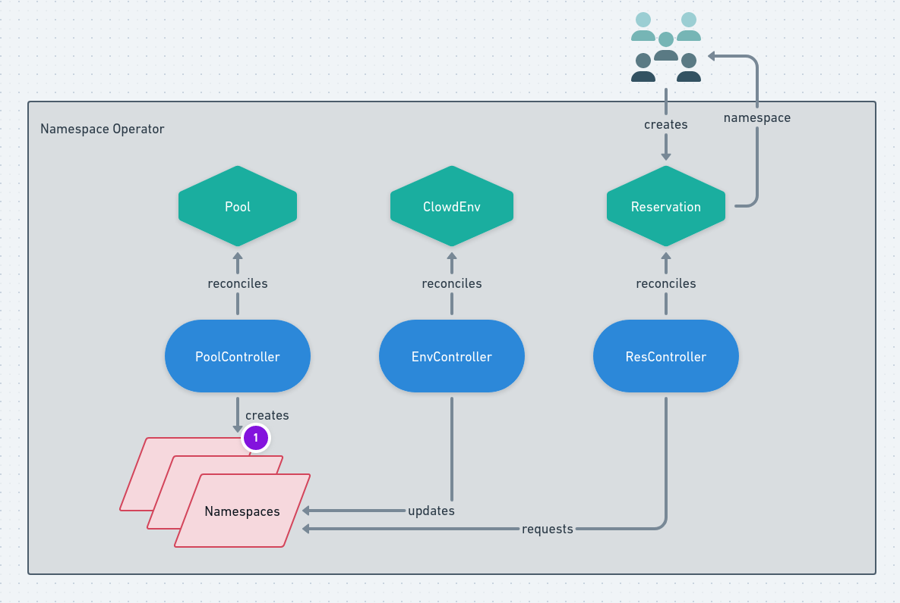

= Ephemeral Namespace Operator (ENO)

image:https://img.shields.io/github/workflow/status/RedHatInsights/ephemeral-namespace-operator/Run%20Unit%20Tests[Build Passing]
image:https://goreportcard.com/badge/github.com/RedHatInsights/ephemeral-namespace-operator[Go Report Card]

== What is the Ephemeral Namespace Operator?
The purpose of the ephemeral namespace operator is to have namespaces queued up and ready to be utilized. These namespaces  
will have `Clowdenvironments` deployed, and specific resources corresponding to the type of namespace pool a user requests from, ready to go.  

== Benefits For This Approach
- Cuts user's wait-time down since namespaces will already be ready-to-go.
- Ensures that namespaces are not forgotten therefore reducing resource utilization.
- Long-running environments require work to maintain, therefore, having a time limit on them will reduce this issue from happening.

== What Are Namespace Pools?
Given the various needs of our users, we incorporated different pools of ready namespaces that contain specific resources.  
This is to help ensure that when users request a namespace they aren't getting any unnecessary resources within their namespace.  
The current list of pools are `default`, `minimal`, and `managed-kafka`.

== How does it work?
A user will request a namespace which creates a reservation request. From there a namespace is selected from the pool and checked out by that user.  
The user will have that pool for the specified duration (Or for 1 hour if duration was not specified).

A user can use any of the following optional flags to specify their needs:
- `--name`: Specify a reservation name. Ex. `--name my-namespace-reservation`
- `-d, --duration`: Specify the length of time a user wants to reserve the namespace for. Ex. `-d 3h`
- `--pool`: Specify the pool a user wants a namespace from. Ex. `--pool minimal`

When the controller needs to create a new namespace to be added to the "on-deck" pool, it adds the following resources:

- `ClowdEnvironment`:  This will create deployments for Kafka, Kafka Connect, Minio, Prometheus, and feature flags.  
- `FrontendEnvironment`: This sets up environment configurations for the github.com/RedHatInsights/frontend-operator[frontend operator]  
- `RoleBindings`: Access is granted to devs to edit resources in the namespace  
- Secrets are copied from the base namespace.  

